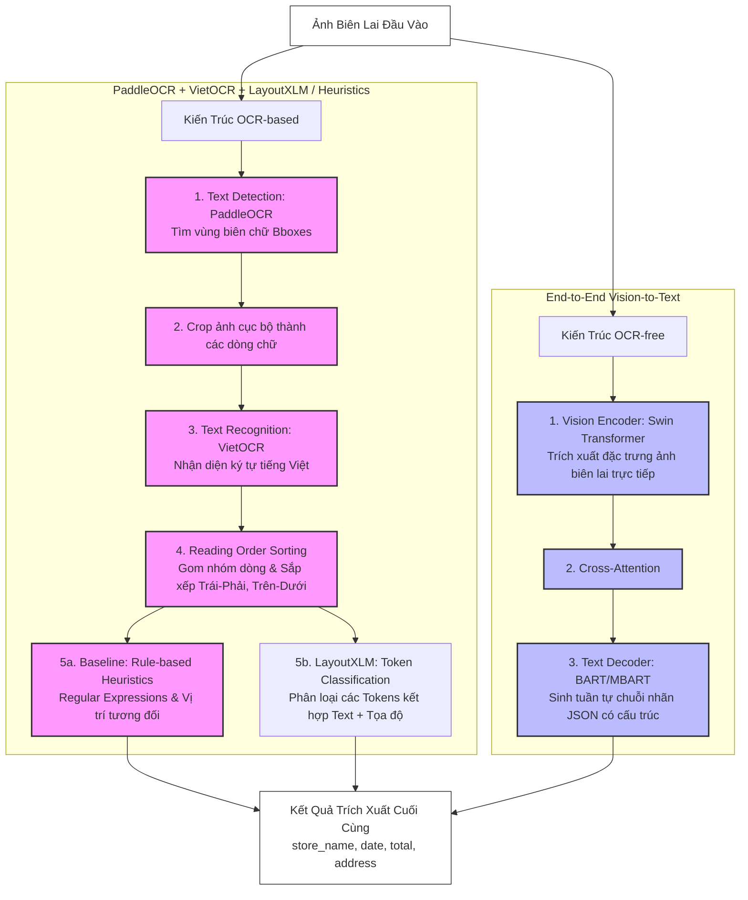

# Báo cáo Phân tích Kiến trúc Thư mục và Mã nguồn — Receipt VN IE

Dự án **Receipt VN IE** (Receipt Vietnamese Information Extraction) tập trung vào việc nghiên cứu, hiện thực hóa và so sánh hai trường phái thiết kế mô hình xử lý văn bản tài liệu phổ biến hiện nay nhằm trích xuất thông tin từ ảnh biên lai thanh toán tiếng Việt:
1. **OCR-based Pipeline** (VietOCR + LayoutXLM hoặc Heuristics/Rules).
2. **OCR-free Pipeline** (Donut - End-to-End Vision Encoder-Decoder).

Mục tiêu là trích xuất chính xác 4 trường thông tin quan trọng của biên lai:
* 🏪 **`store_name`**: Tên cửa hàng (Ví dụ: `MINIMART ANAN`, `Circle K`).
* 📅 **`date`**: Ngày tháng thanh toán, chuẩn hóa về định dạng `YYYY-MM-DD` (Ví dụ: `2026-05-22`).
* 💰 **`total`**: Tổng số tiền thanh toán, chuẩn hóa về dạng số nguyên thuần túy (Ví dụ: `150000`).
* 📍 **`address`**: Địa chỉ cửa hàng xuất hóa đơn (Ví dụ: `123 Đường Nguyễn Trãi, Thanh Xuân, Hà Nội`).

---

## 📂 1. Bản đồ Kiến trúc Hệ thống (Folder Structure Analysis)

Dưới đây là sơ đồ chi tiết cấu trúc thư mục của dự án và vai trò cụ thể của từng phần tử:

```yaml
receipt-vn-ie/
├── ⚙️ configs/                  # Các tệp YAML cấu hình tham số cho toàn hệ thống
│   ├── app.yaml                 # Cấu hình ứng dụng Web Gradio demo
│   ├── baseline.yaml            # Cấu hình bộ trích xuất heuristics
│   ├── data.yaml                # Cấu hình đường dẫn dữ liệu raw, processed
│   ├── donut.yaml               # Cấu hình siêu tham số (Hyperparameters) huấn luyện Donut
│   ├── layoutxlm.yaml           # Cấu hình tham số cho mô hình LayoutXLM
│   ├── ocr.yaml                 # Cấu hình engine PaddleOCR & VietOCR
│   └── preprocess.yaml          # Cấu hình tham số tiền xử lý ảnh và nhãn
│
├── 📊 notebooks/                # Jupyter Notebooks phục vụ phân tích dữ liệu & đánh giá
│   └── (EDA, OCR quality check, error analysis...)
│
├── 🧪 tests/                    # Hệ thống Unit Tests tự động đảm bảo độ ổn định mã nguồn
│   ├── test_baseline.py         # Kiểm thử bộ trích xuất heuristics
│   ├── test_bbox.py             # Kiểm thử các hàm xử lý tọa độ bounding box
│   ├── test_donut.py            # Kiểm thử tích hợp mô hình Donut
│   ├── test_end_to_end_smoke.py # Test luồng chạy E2E giả lập (Smoke Test) offline
│   ├── test_layoutxlm.py        # Kiểm thử tích hợp mô hình LayoutXLM
│   ├── test_metrics.py          # Kiểm thử tính đúng đắn của các công thức tính EM, NES, CER
│   └── test_ocr_pipeline.py     # Kiểm thử sự kết hợp giữa PaddleOCR và VietOCR
│
├── 📦 requirements/             # Quản lý các thư viện phụ thuộc theo từng môi trường
│   ├── base.txt                 # Các thư viện cốt lõi (PyTorch, Transformers, pandas...)
│   ├── ocr.txt                  # Thư viện phục vụ nhận diện chữ (VietOCR, RapidFuzz...)
│   ├── paddle-cpu/gpu.txt       # Engine phát hiện vùng chữ PaddleOCR
│   └── app.txt                  # Thư viện cho giao diện demo (Gradio)
│
└── 🛠️ src/receipt_ie/           # Mã nguồn lõi của dự án (Lớp xử lý chính)
    ├── 🖥️ app/                  # Ứng dụng Web tương tác người dùng
    │   └── gradio_app.py        # Giao diện web tải ảnh lên và chạy so sánh 3 phương pháp
    │
    ├── 🛡️ baseline/             # Phương pháp cơ bản dựa trên Heuristic quy luật
    │   └── rule_extractor.py    # Regex & heuristics phân tích text từ kết quả OCR phẳng
    │
    ├── 💾 data/                 # Đường ống (Pipeline) xử lý dữ liệu đầu vào
    │   ├── schemas.py           # Định nghĩa cấu trúc dữ liệu, interface BaseExtractor chung
    │   ├── normalize_text.py    # Bộ tiền xử lý chữ viết, ngày tháng và tiền tệ tiếng Việt
    │   ├── convert_mcocr.py     # Chuyển đổi dữ liệu MC-OCR 2021 sang định dạng JSONL thống nhất
    │   ├── convert_labelstudio.py # Chuyển đổi dữ liệu gán nhãn từ Label Studio sang JSONL
    │   ├── convert_cord.py      # Tiền xử lý tập dữ liệu CORD v2 phục vụ warm-up model
    │   ├── split_data.py        # Chia dữ liệu (Train/Val/Test) ngẫu nhiên theo tỷ lệ khoa học
    │   └── validate_dataset.py  # Kiểm tra tính hợp lệ về cấu trúc & nhãn của tệp processed
    │
    ├── 👁️ ocr/                  # Mô-đun OCR hai pha (Two-stage OCR)
    │   ├── detect_paddle.py     # Nhận dạng vùng chứa chữ (Bbox) sử dụng PaddleOCR
    │   ├── recognize_vietocr.py # Nhận dạng ký tự tiếng Việt trong bbox sử dụng VietOCR
    │   ├── reading_order.py     # Thuật toán phân dòng văn bản và sắp xếp thứ tự đọc tự nhiên
    │   └── build_ocr_cache.py   # Lưu cache kết quả OCR để tăng tốc độ huấn luyện/suy luận
    │
    ├── 🤖 models/               # Định nghĩa các Model Wrapper cấu hình Transformer
    │   ├── donut_model.py       # Cấu hình Tokenizer & VisionEncoderDecoder cho Donut
    │   ├── donut_dataset.py     # Dataset loader chuyển hóa ảnh-nhãn thành cấu trúc Donut
    │   ├── layoutxlm_model.py   # Thiết lập mô hình phân loại Token Classification LayoutXLM
    │   └── layoutxlm_dataset.py # Lớp Dataset chuẩn bị dữ liệu đầu vào tích hợp bboxes
    │
    ├── ⚡ inference/            # Pipeline chạy suy luận dự đoán trên môi trường thực tế
    │   ├── pipeline.py          # Bộ khởi tạo Extractor Factory trung tâm
    │   ├── infer_baseline.py    # Luồng suy luận e2e cho Baseline Extractor
    │   ├── infer_donut.py       # Luồng suy luận e2e cho Donut Extractor
    │   ├── infer_layoutxlm.py   # Luồng suy luận e2e cho LayoutXLM Extractor
    │   └── mock_extractor.py    # Lớp Mock chạy offline hỗ trợ UI demo khi thiếu GPU
    │
    └── 📈 metrics/              # Các độ đo hiệu năng chuyên biệt trích xuất thông tin
        ├── evaluate_fields.py   # Tính toán Exact Match (EM), NES (Edit Similarity), CER
        └── latency.py           # Đo lường thời gian đáp ứng (Latency) của từng thành phần
```

---

## 🎨 2. Sơ đồ Hoạt động của Hai Luồng Kiến trúc (Workflow Pipeline)



---

## 💻 3. Phân tích Chi tiết Các Tệp Mã nguồn Lõi (Code Deep Dive)

Dưới đây là phân tích chi tiết kỹ thuật đối với các thành phần cốt lõi tạo nên sức mạnh xử lý của dự án:

### ⚙️ 3.1. Chuẩn hóa Văn bản Tiếng Việt (`src/receipt_ie/data/normalize_text.py`)
Tệp này chịu trách nhiệm làm sạch dữ liệu thô (raw text) được trả ra từ mô hình nhận diện hoặc do người dùng gõ vào, chuẩn hóa chúng về một cấu trúc định danh chính xác trước khi đưa vào tính toán độ đo.

*   **Chuẩn hóa Unicode Dựng sẵn (`NFC`):** 
    Tiếng Việt có hai chuẩn gán dấu ký tự: **NFC** (dựng sẵn, ví dụ chữ `á` là một ký tự duy nhất `\u00e1`) và **NFD** (tổ hợp, ví dụ chữ `á` là chữ `a` đi kèm ký tự dấu sắc rời `\u0061\u0301`). Tệp sử dụng `unicodedata.normalize("NFC", s)` để đưa toàn bộ văn bản về dạng thống nhất, tránh việc so sánh chuỗi sai lệch.
*   **Chuẩn hóa Ngày tháng (`normalize_date`):**
    Sử dụng ba bộ Regex sắp xếp theo mức độ ưu tiên từ chi tiết nhất đến tổng quát nhất:
    1. `YYYY-MM-DD` hoặc `YYYY/MM/DD` (mẫu: `r"\b(\d{4})[/-](\d{1,2})[/-](\d{1,2})\b"`)
    2. `DD-MM-YYYY` hoặc `DD/MM/YYYY` (mẫu: `r"\b(\d{1,2})[/-](\d{1,2})[/-](\d{4})\b"`)
    3. `DD-MM-YY` hoặc `DD/MM/YY` (mẫu: `r"\b(\d{1,2})[/-](\d{1,2})[/-](\d{2})\b"`)
    
    Sau khi trích xuất được các thành phần Ngày, Tháng, Năm, tệp sẽ đưa qua đối tượng `datetime(year, month, day)` để kiểm tra tính hợp lý (Ví dụ: sẽ bỏ qua nếu ngày là 31/02 hoặc tháng là 13) và xuất ra định dạng duy nhất `%Y-%m-%d`.
*   **Chuẩn hóa Tiền tệ (`normalize_money`):**
    * Loại bỏ các đơn vị tiền tệ tiếng Việt thông dụng như `vnđ`, `vnd`, `đồng`, `đ` cũng như các chuỗi bổ trợ `total`, `tổng cộng`.
    * Tìm tất cả chuỗi số dạng `\d[\d\.,\s]*`. Chọn chuỗi dài nhất để làm tiền đề (tránh các số nhỏ lẻ khác trong hóa đơn như đơn giá hoặc số lượng).
    * Loại bỏ toàn bộ ký tự phi số (khoảng trắng, dấu chấm, dấu phẩy phân tách hàng nghìn) bằng `re.sub(r"[^\d]", "", num)`.
    * Loại bỏ các chữ số `0` vô nghĩa ở vị trí đầu tiên (bằng `lstrip("0")`).

---

### 🛡️ 3.2. Bộ Trích xuất Heuristic Quy luật (`src/receipt_ie/baseline/rule_extractor.py`)
Bộ trích xuất heuristics đóng vai trò là cột mốc cơ bản (Baseline). Phương pháp này không cần dữ liệu huấn luyện cao cấp mà dựa trên định vị không gian và cấu trúc đặc thù của hóa đơn để suy diễn các trường thông tin.

1.  **Trích xuất Tên cửa hàng (`store_name`):**
    *   **Giả định không gian:** Tên cửa hàng luôn nằm ở vị trí trên cùng của biên lai thanh toán.
    *   **Thuật toán:** Duyệt qua tối đa **5 dòng đầu tiên** của văn bản phẳng đã sắp xếp theo thứ tự đọc tự nhiên.
    *   **Loại trừ nhiễu:** Dòng được chọn làm tên cửa hàng phải không chứa các từ khóa liên quan đến số điện thoại, mã số thuế (MST), website, email (`tel`, `phone`, `mst`, `tax`, `website`, `email`). Ngoài ra, dòng không được chứa tỷ lệ chữ số quá cao (`digit_ratio > 0.4`), vì đây có thể là số hóa đơn hoặc ngày tháng.
2.  **Trích xuất Ngày tháng (`date`):**
    *   Duyệt tuần tự từ trên xuống dưới toàn bộ các dòng chữ thu được từ OCR. Đưa từng dòng qua bộ lọc `normalize_date`. Dòng đầu tiên trả về giá trị ngày tháng hợp lệ sẽ được lấy ngay làm kết quả.
3.  **Trích xuất Địa chỉ (`address`):**
    *   Định nghĩa một tập các từ khóa hành chính đặc trưng của Việt Nam: `đường`, `phố`, `ngõ`, `quận`, `huyện`, `thành phố`, `tp`, `tỉnh`, `phường`, `xã`, `ấp`, `thôn`, `tổ`, `khu`.
    *   Duyệt tìm dòng đầu tiên khớp với một trong các từ khóa này.
    *   **Mở rộng ngữ cảnh:** Nếu dòng tiếp theo ngay sau dòng chứa từ khóa không chứa các từ cấm (như `tel`, `total`, `ngày`), thuật toán sẽ gộp dòng kế tiếp này vào chuỗi địa chỉ để đảm bảo trích xuất đầy đủ thông tin địa chỉ dài xuống dòng.
4.  **Trích xuất Tổng tiền (`total`):**
    *   **Giả định không gian:** Tổng tiền luôn nằm ở các dòng cuối cùng của biên lai.
    *   **Thuật toán:** Duyệt ngược từ **dưới lên trên**. Tìm kiếm các từ khóa thanh toán đặc thù (`tổng cộng`, `tong cong`, `thanh toán`, `total`, `cần trả`, `thành tiền`, `tiền mặt`).
    *   **Phân tích lân cận:** Khi tìm thấy từ khóa:
        *   Bước 1: Tìm kiếm số tiền chuẩn hóa trên **chính dòng đó**.
        *   Bước 2: Nếu chính dòng đó không chứa số tiền, kiểm tra **dòng ngay phía sau**.
        *   Bước 3: Nếu dòng sau không có, kiểm tra **dòng ngay phía trước**.
    *   **Cơ chế dự phòng (Fallback):** Nếu không tìm thấy từ khóa phù hợp nào, thuật toán sẽ thu thập toàn bộ các số tiền hợp lý nằm trong khoảng từ `1,000đ` đến `1,000,000,000đ` ở **nửa cuối** hóa đơn và trả về số tiền lớn nhất (vì tổng tiền thường là giá trị lớn nhất so với các đơn giá lẻ hoặc thuế phí VAT).

---

### 👁️ 3.3. Thuật toán Thứ tự Đọc Tự nhiên (`src/receipt_ie/ocr/reading_order.py`)
Mô hình OCR trả về các bounding box (bboxes) của từ một cách ngẫu nhiên tùy thuộc vào thứ tự nhận dạng của thuật toán phát hiện vùng chữ. Nếu chỉ ghép chuỗi thô theo danh sách trả ra, văn bản thu được sẽ bị xáo trộn nghiêm trọng. Hàm `sort_reading_order` sắp xếp lại theo logic từ trái qua phải, từ trên xuống dưới:

*   **Bước 1 (Sắp xếp thô):** Sắp xếp tất cả regions dựa theo tọa độ cạnh trên tăng dần (`bbox[1]` tức `y0`).
*   **Bước 2 (Gom nhóm dòng bằng khoảng cách y_center):**
    *   Với mỗi vùng chữ, xác định tọa độ tâm theo chiều dọc $y_{center} = \frac{y_0 + y_1}{2}$.
    *   Duyệt qua các dòng hiện tại, tính $y_{center}$ trung bình của toàn bộ các phần tử trong dòng đó.
    *   Nếu sai lệch $|y_{center} - y_{avg\_line}| \le y_{threshold}$ (mặc định là 12 pixels), đưa vùng chữ này vào dòng hiện tại.
    *   Nếu không thỏa mãn bất kỳ dòng nào, khởi tạo một dòng mới chứa vùng chữ này.
*   **Bước 3 (Sắp xếp ngang):** Với mỗi dòng đơn lẻ sau gom nhóm, thực hiện sắp xếp các vùng chữ từ trái qua phải dựa trên tọa độ bắt đầu `x0` (`bbox[0]`).
*   **Bước 4 (Sắp xếp dọc toàn cục):** Sắp xếp lại toàn bộ các dòng theo thứ tự từ trên xuống dưới dựa vào giá trị $y_{center}$ trung bình của từng dòng để tạo ra luồng thông tin phẳng trơn tru và chính xác.

---

### 🤖 3.4. Cấu hình Nhúng Mô hình Donut (`src/receipt_ie/models/donut_model.py`)
Donut (Document Understanding Transformer) là mô hình OCR-free loại bỏ hoàn toàn module nhận dạng chữ riêng lẻ. Để huấn luyện mô hình sinh ra định dạng JSON mong muốn trực tiếp từ ảnh biên lai, cấu hình Donut cần tùy biến sâu:

*   **Định nghĩa Special Tokens:** Mô hình cần các mã token đặc biệt để đánh dấu cấu trúc trường. Chúng được khai báo bao gồm:
    *   Task tokens định danh tác vụ: `<s_receipt_ie>` và đóng `</s_receipt_ie>` (hoặc tương tự cho tập CORD).
    *   Các thẻ mở và thẻ đóng cho từng trường thông tin mục tiêu:
        *   `<s_store_name>`, `</s_store_name>`
        *   `<s_date>`, `</s_date>`
        *   `<s_total>`, `</s_total>`
        *   `<s_address>`, `</s_address>`
*   **Cập nhật Tokenizer:** Thêm các special tokens này vào bộ từ vựng (Vocabulary) của tokenizer bằng `processor.tokenizer.add_tokens(new_tokens)`.
*   **Tái cấu trúc Decoder Embeddings:** Khi vốn từ vựng tăng lên, kích thước lớp embedding của bộ giải mã (decoder) cần phải được thiết lập lại để khớp với số lượng token thực tế: `model.decoder.resize_token_embeddings(len(processor.tokenizer))`.
*   **Thiết lập tham số Generation:** Gán tham số cấu hình khởi tạo của bộ giải mã `model.config.decoder_start_token_id` trỏ thẳng tới ID của token bắt đầu tác vụ `<s_receipt_ie>`.

---

### 📈 3.5. Hệ thống Đánh giá Hiệu năng (`src/receipt_ie/metrics/evaluate_fields.py`)
Để đưa ra kết luận phương pháp nào vượt trội, hệ thống tích hợp 3 thang đo toán học cốt lõi:

1.  **Exact Match (EM):** Khớp tuyệt đối 100%. Chuỗi dự đoán sau khi qua bộ tiền chuẩn hóa phải giống hệt chuỗi ground truth.
    $$\text{EM} = \begin{cases} 1.0 & \text{nếu } pred = gold \\ 0.0 & \text{ngược lại} \end{cases}$$
2.  **Normalized Edit Similarity (NES):** Tính toán độ tương đồng dựa trên khoảng cách Levenshtein (số thao tác chèn, xóa, thay thế ký tự tối thiểu để chuyển đổi chuỗi này sang chuỗi kia), chuẩn hóa theo chiều dài chuỗi tối đa:
    $$\text{NES}(pred, gold) = 1.0 - \frac{\text{LevenshteinDistance}(pred, gold)}{\max(\text{len}(pred), \text{len}(gold))}$$
    *Thang đo này rất công bằng vì phản ánh trực quan việc mô hình gõ nhầm một vài ký tự do OCR sai lệch.*
3.  **Character Error Rate (CER):** Tỷ lệ lỗi ký tự so với độ dài của chuỗi mục tiêu gốc:
    $$\text{CER}(pred, gold) = \frac{\text{LevenshteinDistance}(pred, gold)}{\text{len}(gold)}$$

Hàm `evaluate_predictions` tự động gom nhóm, map khớp các mẫu qua thuộc tính `id`, loại bỏ các bản ghi gặp lỗi kỹ thuật trong lúc suy luận (`status == "error"`) và tính trung bình số học (Macro Average) trên toàn bộ tập dữ liệu kiểm thử.

---

## 🚀 4. Hướng dẫn Chạy Quy trình Thực nghiệm (Workflow Run)

Dưới đây là các câu lệnh chính để vận hành toàn bộ luồng xử lý và đánh giá của hệ thống:

### 📥 Bước 1: Tiền xử lý dữ liệu sang định dạng JSONL thống nhất
Hệ thống chuyển đổi dữ liệu từ nhiều nguồn khác nhau (MC-OCR, Label Studio, CORD) về một kiểu dữ liệu chung dạng JSONL:
```bash
# Trích xuất và định dạng lại MC-OCR 2021
python -m receipt_ie.data.convert_mcocr

# Trích xuất dữ liệu gán nhãn từ Label Studio
python -m receipt_ie.data.convert_labelstudio

# Tải và xử lý tập dữ liệu warm-up CORD
python -m receipt_ie.data.download_cord
python -m receipt_ie.data.convert_cord
```

### ✂️ Bước 2: Phân tách tập dữ liệu và chạy đánh giá hợp lệ
Phân chia dữ liệu theo tỷ lệ ngẫu nhiên cố định hạt giống (Seed) để đảm bảo tính lặp lại của thực nghiệm, sau đó chạy trình xác thực cấu trúc:
```bash
# Chia dữ liệu thành các tệp train.jsonl, val.jsonl, test.jsonl
python -m receipt_ie.data.split_data

# Kiểm tra xác thực các tệp dữ liệu đã xử lý
python -m receipt_ie.data.validate_dataset --jsonl_path data/processed/train.jsonl
```

### 🏋️ Bước 3: Huấn luyện các mô hình học sâu (Deep Learning Models)
```bash
# Huấn luyện mô hình Donut (OCR-free) dựa trên cấu hình donut.yaml
python -m receipt_ie.training.train_donut

# Huấn luyện mô hình LayoutXLM (OCR-based) dựa trên cấu hình layoutxlm.yaml
python -m receipt_ie.training.train_layoutxlm
```

### 📊 Bước 4: Chạy suy luận và tính toán chỉ số hiệu năng trên tập Test
```bash
# Chạy suy luận với phương pháp Baseline Heuristic quy luật
python -m receipt_ie.inference.infer_baseline --test_jsonl data/processed/test.jsonl --output_jsonl outputs/predictions/baseline_test.jsonl

# Đánh giá chỉ số chi tiết (EM, NES, CER)
# So sánh outputs/predictions/baseline_test.jsonl với data/processed/test.jsonl thông qua metrics.py hoặc test suite
```

### 🧪 Bước 5: Chạy toàn bộ hệ thống Unit Tests để xác thực độ tin cậy của code
```bash
pytest tests/
```

### 🖥️ Bước 6: Khởi chạy Giao diện Web tương tác Demo (Gradio App)
Trải nghiệm trực quan khả năng trích xuất bằng cách tải ảnh biên lai lên giao diện web và chọn mô hình so sánh:
```bash
python -m receipt_ie.app.gradio_app
```

---

> [!NOTE]
> Hệ thống được thiết kế theo nguyên lý mô-đun hóa cao, giao diện `BaseExtractor` quy chuẩn đảm bảo việc tích hợp các mô hình học máy mới hoặc thay thế engine OCR (ví dụ: chuyển sang EasyOCR hay Tesseract) diễn ra cực kỳ dễ dàng mà không làm ảnh hưởng tới luồng xử lý chung của toàn hệ thống.
