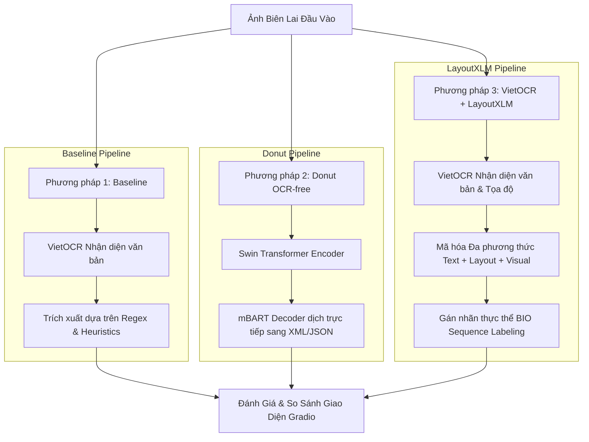

# BÁO CÁO KHOA HỌC DỰ ÁN TRÍCH XUẤT THÔNG TIN HÓA ĐƠN TIẾNG VIỆT
**Đề tài:** Nghiên cứu và so sánh hai phương pháp trích xuất thông tin hóa đơn (Receipt Information Extraction - IE) sử dụng kiến trúc End-to-End OCR-free (Donut) và Đa phương thức kết hợp OCR (VietOCR + LayoutXLM)

---

## 1. TÓM TẮT (Abstract)
Trích xuất thông tin tự động từ hóa đơn biên lai đóng vai trò quan trọng trong việc số hóa dữ liệu tài chính doanh nghiệp. Nghiên cứu này trình bày việc thiết kế, huấn luyện và đánh giá hai hệ thống trích xuất thông tin hóa đơn tiếng Việt dựa trên hai trường phái công nghệ tiên tiến nhất hiện nay: (1) **Donut** (kiến trúc Vision-Encoder-Decoder đầu-cuối không cần bộ OCR trung gian) và (2) **VietOCR + LayoutXLM** (kiến trúc đa phương thức dựa trên nhận diện chữ OCR kết hợp thông tin không gian biểu diễn trực quan). Các thực nghiệm được tiến hành trên tập dữ liệu tổng hợp từ cuộc thi MC-OCR 2021 kết hợp dữ liệu tự thu thập tại Việt Nam. Kết quả thực nghiệm cho thấy phương pháp VietOCR + LayoutXLM đạt độ chính xác F1-score vượt trội (~81.8% đối với các thực thể gán nhãn, độ chính xác token 96.7%), trong khi mô hình Donut thể hiện ưu thế vượt trội về tính tối giản của pipeline và tốc độ trích xuất đầu-cuối (E2E Latency) không phụ thuộc vào các module OCR truyền thống.

---

## 2. GIỚI THIỆU (Introduction)
### 2.1. Đặt vấn đề
Hóa đơn, biên lai bán lẻ là các tài liệu bán cấu trúc (semi-structured documents) chứa thông tin có giá trị cao như tên cửa hàng, ngày giao dịch, tổng tiền thanh toán và địa chỉ. Việc nhập liệu thủ công các thông tin này tốn nhiều thời gian và dễ xảy ra sai sót. Trích xuất thông tin tự động (Information Extraction - IE) từ ảnh chụp hóa đơn gặp nhiều thách thức lớn:
- **Chất lượng ảnh phức tạp:** Hóa đơn thường được chụp trong điều kiện ánh sáng kém, bị mờ, quăn, hoặc nhàu nát, làm giảm chất lượng nhận dạng ký tự quang học.
- **In ấn chất lượng thấp:** Nhiều biên lai sử dụng công nghệ in nhiệt trên giấy chất lượng kém, dẫn đến chữ bị mờ nhạt, mất nét hoặc bị ố vàng theo thời gian.
- **Tính đa dạng về layout:** Mỗi cửa hàng, chuỗi siêu thị hoặc nhà hàng có một cách thiết kế bố cục hóa đơn khác nhau, không tuân theo quy chuẩn cố định về vị trí hay kích thước các trường thông tin.
- **Đặc trưng ngôn ngữ tiếng Việt:** Tiếng Việt có dấu thanh phức tạp (dễ bị nhầm lẫn khi nhận dạng OCR), viết hoa không nhất quán, sử dụng nhiều ký tự đặc biệt, viết tắt vùng miền (ví dụ: "Q.", "P.", "TP.", "đ", "VND") và các cấu trúc ngữ pháp phi chuẩn.

### 2.2. Mục tiêu nghiên cứu
- Xây dựng thành công hệ thống trích xuất 4 trường thông tin cốt lõi: `STORE_NAME` (Tên cửa hàng), `DATE` (Ngày tháng), `TOTAL` (Tổng tiền), và `ADDRESS` (Địa chỉ).
- Huấn luyện chuyển giao (Fine-tuning) hai mô hình Donut và LayoutXLM trên tập dữ liệu biên lai Việt Nam.
- Thiết lập hệ thống so sánh trực quan hiệu năng (độ trích xuất chính xác và thời gian xử lý) giữa hai trường phái công nghệ.

---

## 3. PHƯƠNG PHÁP TIẾP CẬN VÀ CƠ SỞ LÝ THUYẾT (Methodology & Theoretical Background)

Nghiên cứu tiến hành so sánh ba phương pháp tiếp cận chính được biểu diễn qua sơ đồ quy trình dưới đây:

### 3.1. Phương pháp 1: Baseline (Rule-based & Regex kết hợp VietOCR)
Phương pháp này chia quá trình trích xuất làm hai pha độc lập: Nhận dạng chữ (OCR) bằng VietOCR và áp dụng các biểu thức chính quy (Regex) kết hợp heuristics để lọc thông tin.

#### 3.1.1. Nhận dạng ký tự quang học (OCR) với VietOCR và CTC Loss
VietOCR sử dụng kiến trúc CRNN (CNN + BiLSTM). Mạng tích chập CNN trích xuất các đặc trưng hình ảnh dòng chữ, sau đó mạng hồi quy hai chiều BiLSTM mô hình hóa thông tin ngữ cảnh chuỗi ký tự theo thời gian. 
Để ánh xạ đặc trưng ảnh sang chuỗi văn bản mà không cần căn chỉnh (alignment) mức pixel giữa ảnh và nhãn ký tự, mạng được huấn luyện bằng hàm mất mát **Connectionist Temporal Classification (CTC Loss)**:

*   Gọi $\mathbf{x} = (x_1, x_2, \dots, x_T)$ là chuỗi đặc trưng đầu ra của CNN đưa vào LSTM. Tại mỗi bước thời gian $t$, mô hình xuất ra phân phối xác suất trên tập ký tự mở rộng $L' = L \cup \{\epsilon\}$ (trong đó $L$ là bảng chữ cái tiếng Việt và $\epsilon$ là ký tự trống):
    $$P(\pi_t \mid \mathbf{x}) = y_t^{\pi_t}, \quad \pi_t \in L'$$
*   Xác suất của một đường đi cụ thể $\mathbf{\pi} = (\pi_1, \pi_2, \dots, \pi_T)$ qua các bước thời gian được giả định là độc lập có điều kiện:
    $$P(\mathbf{\pi} \mid \mathbf{x}) = \prod_{t=1}^{T} y_t^{\pi_t}$$
*   Gọi $\mathcal{B}: L'^T \to L^{\le T}$ là toán tử biến đổi chuỗi bằng cách trước tiên gộp các ký tự trùng lặp liên tiếp, sau đó loại bỏ tất cả các ký tự trống $\epsilon$. Ví dụ: $\mathcal{B}(\text{a}\epsilon\text{ab}\text{b}) = \text{aab}$. Xác suất của một chuỗi văn bản đích $\mathbf{y}$ được tính bằng tổng xác suất của tất cả các đường đi hợp lệ $\mathbf{\pi}$ ánh xạ về $\mathbf{y}$:
    $$P(\mathbf{y} \mid \mathbf{x}) = \sum_{\mathbf{\pi} \in \mathcal{B}^{-1}(\mathbf{y})} P(\mathbf{\pi} \mid \mathbf{x})$$
*   Hàm mất mát CTC Loss tối thiểu hóa log-likelihood âm của nhãn mục tiêu:
    $$\mathcal{L}_{\text{CTC}} = -\ln P(\mathbf{y} \mid \mathbf{x})$$

#### 3.1.2. Trích xuất dựa trên biểu thức chính quy (Regex & Heuristics)
Văn bản thô từ VietOCR sau đó được phân tích dựa trên lý thuyết Ô-tô-mát hữu hạn định cực thông qua các biểu thức chính quy tĩnh:
*   **DATE:** Khớp các mẫu dựa trên cấu trúc ngày tháng `dd/mm/yyyy` hoặc `dd-mm-yyyy` sử dụng biểu thức chính quy:
    `\b(0?[1-9]|[12]\d|3[01])[-/](0?[1-9]|1[012])[-/](\d{4}|\d{2})\b`
*   **TOTAL:** Định vị các từ khóa neo $K = \{\text{"Tổng cộng"}, \text{"Thanh toán"}, \text{"Total"}, \text{"Cộng tiền"}\}$, sau đó tìm kiếm trong bán kính $N$ dòng tiếp theo cụm số đại diện cho giá trị tiền tệ:
    `\d{1,3}([.,]\d{3})*`
*   **ADDRESS:** So khớp từ khóa hành chính Việt Nam và lấy phân đoạn văn bản bao quanh:
    `(Số|Đường|Phường|Quận|Huyện|Tỉnh|Thành phố|Xã|Thị xã|TP).*`

*   **Hạn chế:** Phương pháp này hoàn toàn tĩnh, không tự học và cực kỳ nhạy cảm với lỗi chính tả từ bộ OCR (Error Cascade).

### 3.2. Phương pháp 2: Donut (Document Understanding Transformer - OCR-free)
Donut loại bỏ hoàn toàn bộ OCR trung gian, giải quyết bài toán dưới dạng **Dịch ngôn ngữ trực quan (Visual Language Translation)** bằng kiến trúc Vision-Encoder-Decoder.

#### 3.2.1. Vision Encoder: Swin Transformer
Swin Transformer hoạt động trên cơ chế tự chú ý cục bộ trong các cửa sổ dịch chuyển để trích xuất đặc trưng trực quan đa tỷ lệ của hóa đơn:
1.  **Chia Patch và Nhúng vị trí:** Ảnh đầu vào $\mathbf{X} \in \mathbb{R}^{H \times W \times C}$ được chia thành các patch ảnh kích thước $4 \times 4$. Mỗi patch được chiếu tuyến tính thành một vector đặc trưng $D$-chiều.
2.  **Window-based Multi-head Self-Attention (W-MSA):** Để giảm độ phức tạp tính toán từ bậc hai $O(N^2)$ xuống tuyến tính $O(N)$, ảnh được chia thành các cửa sổ cục bộ kích thước $M \times M$ (ví dụ $M=7$). Self-attention chỉ được tính toán trong phạm vi mỗi cửa sổ độc lập:
    $$\text{Attention}(Q, K, V) = \text{softmax}\left(\frac{QK^T}{\sqrt{d}} + B\right)V$$
    Trong đó $Q, K, V \in \mathbb{R}^{M^2 \times d}$ lần lượt là các ma trận truy vấn, khóa và giá trị. Ma trận $B \in \mathbb{R}^{M^2 \times M^2}$ đại diện cho **Nhúng thiên lệch vị trí tương đối (Relative Position Bias)** học được, mô tả quan hệ hình học cục bộ giữa các pixel.
3.  **Shifted Window-based Multi-head Self-Attention (SW-MSA):** Nhằm thiết lập sự liên kết thông tin giữa các cửa sổ cận kề, layer tiếp theo thực hiện dịch chuyển các cửa sổ đi một khoảng bằng $\left(\lfloor \frac{M}{2} \rfloor, \lfloor \frac{M}{2} \rfloor\right)$ pixel trước khi tính toán attention.

#### 3.2.2. Text Decoder: mBART
Decoder tự hồi quy mBART dịch trực tiếp các vector đặc trưng visual $\mathbf{z}$ của Swin Encoder sang chuỗi token cấu trúc định dạng XML:
1.  **Decoder Self-Attention:** Tính toán sự phụ thuộc giữa các token văn bản đã sinh ra trong quá khứ:
    $$\mathbf{h}_i^{\text{self}} = \text{Self-Attention}(\mathbf{s}_i, \mathbf{s}_{<i})$$
2.  **Decoder Cross-Attention:** Liên kết thông tin ngữ nghĩa đang giải mã với thông tin visual từ ảnh thông qua cơ chế chú ý chéo:
    $$\mathbf{h}_i^{\text{cross}} = \text{softmax}\left(\frac{(\mathbf{h}_i^{\text{self}} W^Q)(\mathbf{z} W^K)^T}{\sqrt{d}}\right)(\mathbf{z} W^V)$$
    Trong đó $\mathbf{z} \in \mathbb{R}^{N_{patch} \times d_{enc}}$ là đầu ra của Swin Encoder.
3.  **Hàm mục tiêu huấn luyện (Teacher Forcing):**
    Mô hình được huấn luyện bằng cách tối thiểu hóa hàm mất mát Cross-Entropy trên chuỗi token đích, sử dụng Teacher Forcing (nạp token đích thực tế của bước trước $y_{<i}^*$ thay vì token dự đoán):
    $$\mathcal{L}_{\text{Donut}} = -\sum_{i=1}^{T} \log P(y_i \mid y_{<i}^*, \mathbf{z})$$

*   **Đánh giá lý thuyết:** Donut rất mạnh trong việc biểu diễn trực quan đầu-cuối và đơn giản hóa pipeline, tuy nhiên nó thiếu cơ chế định vị vật lý (spatial grounding) dẫn đến hiện tượng ảo giác (hallucination) văn bản khi gặp ảnh chất lượng kém hoặc bố cục hóa đơn quá dài.

---

### 3.3. Phương pháp 3: VietOCR + LayoutXLM (Multimodal OCR-based)
Phương pháp này dựa trên lý thuyết học biểu diễn đa phương thức đồng thời kết hợp ba nguồn đặc trưng: Văn bản (Text), Không gian (Layout/2D Position) và Hình ảnh (Visual).

#### 3.3.1. Nhúng đa phương thức tích hợp (Multimodal Joint Embedding)
Đối với mỗi token thứ $i$ trong tài liệu, mô hình kết hợp ba vector nhúng:
1.  **Text Embedding ($\mathbf{t}_i$):** Token văn bản (từ VietOCR) được đưa qua bảng nhúng của XLM-RoBERTa:
    $$\mathbf{t}_i = \text{WordEmbedding}(w_i)$$
2.  **2D Spatial Position Embedding ($\mathbf{e}_{2D}$):** Tọa độ bounding box của từ $\text{bbox}_i = [x_{min}, y_{min}, x_{max}, y_{max}]$ được chuẩn hóa về dải nguyên $[0, 1000]$ dựa trên kích thước ảnh $(W, H)$:
    $$x_1 = \left\lfloor 1000 \times \frac{x_{min}}{W} \right\rfloor, \quad y_1 = \left\lfloor 1000 \times \frac{y_{min}}{H} \right\rfloor, \quad x_2 = \left\lfloor 1000 \times \frac{x_{max}}{W} \right\rfloor, \quad y_2 = \left\lfloor 1000 \times \frac{y_{max}}{H} \right\rfloor$$
    Việc chuẩn hóa này vô cùng quan trọng vì nó giúp mô hình loại bỏ sự phụ thuộc vào độ phân giải ảnh gốc, mang lại tính bất biến về tỷ lệ (scale invariance) và đảm bảo các hóa đơn có kích thước khác nhau đều được biểu diễn trên cùng một lưới tọa độ chuẩn hóa.
    Tính toán thêm chiều rộng $w = x_2 - x_1$ và chiều cao $h = y_2 - y_1$. Vector nhúng 2D được tạo ra bằng cách cộng các vector nhúng tọa độ từ các bảng nhúng tương ứng:
    $$\mathbf{e}_{2D}(\text{bbox}_i) = \mathbf{e}_{x_1}(x_1) + \mathbf{e}_{y_1}(y_1) + \mathbf{e}_{x_2}(x_2) + \mathbf{e}_{y_2}(y_2) + \mathbf{e}_{w}(w) + \mathbf{e}_{h}(h)$$
3.  **Visual Embedding ($\mathbf{v}_i$):** Sử dụng mạng CNN backbone (ResNeXt-101 FPN) trích xuất bản đồ đặc trưng trực quan của ảnh hóa đơn. Đặc trưng visual cục bộ của từng từ được cắt trích bằng thuật toán **RoIAlign** dựa trên bounding box tương ứng:
    $$\mathbf{v}_i = \text{RoIAlign}(\text{FeatureMap}, \text{bbox}_i) W^V$$

Vector biểu diễn hợp nhất đầu vào cho token $i$ là tổng của cả ba thành phần nhúng:
$$\mathbf{x}_i = \mathbf{t}_i + \mathbf{e}_{2D}(\text{bbox}_i) + \mathbf{v}_i$$

#### 3.3.2. Cơ chế Spatial-aware Self-Attention
Mạng Transformer đa phương thức của LayoutXLM sử dụng cơ chế tự chú ý có ràng buộc không gian 2D để học mối liên hệ hình học tương đối giữa các token:
$$\alpha_{ij} = \frac{\mathbf{q}_i \mathbf{k}_j^T}{\sqrt{d}} + b^{1D}(j - i) + b^{2D}_x(x_{1,i} - x_{1,j}) + b^{2D}_y(y_{1,i} - y_{1,j})$$
Trong đó:
*   $\mathbf{q}_i$ là vector query của token $i$, $\mathbf{k}_j$ là vector key của token $j$.
*   $b^{1D}(j - i)$ là bias khoảng cách tương đối dạng 1D truyền thống trong Transformer.
*   $b^{2D}_x(x_{1,i} - x_{1,j})$ và $b^{2D}_y(y_{1,i} - y_{1,j})$ là các bias khoảng cách không gian 2D tương đối dọc theo trục hoành và trục tung của bounding box bắt đầu của hai token.

#### 3.3.3. Phân loại chuỗi (Sequence Labeling với BIO Tagging)
Đầu ra trạng thái ẩn cuối cùng $\mathbf{h}_i^{\text{out}}$ của mỗi token $i$ được đưa qua một lớp phân loại tuyến tính (Linear layer) để dự đoán phân phối xác suất của nhãn BIO tương ứng:
$$\mathbf{p}_i = \text{softmax}(\mathbf{W}_{\text{cls}} \mathbf{h}_i^{\text{out}} + \mathbf{b}_{\text{cls}})$$
Hệ thống sử dụng các nhãn BIO đích: `B/I-STORE_NAME`, `B/I-DATE`, `B/I-TOTAL`, `B/I-ADDRESS`, và `O`. Hàm mất mát tối ưu hóa là Cross-Entropy đa nhãn trên toàn chuỗi:
$$\mathcal{L}_{\text{LayoutXLM}} = -\sum_{i=1}^{N} \log P(y_i \mid \mathbf{x})$$

---

## 4. XÂY DỰNG TẬP DỮ LIỆU (Dataset Construction)

### 4.1. Nguồn dữ liệu
Nghiên cứu sử dụng tập dữ liệu hóa đơn tiếng Việt tổng hợp:
- **MC-OCR 2021 Dataset:** Tập dữ liệu hóa đơn gốc từ cuộc thi, chứa hàng ngàn hóa đơn với các nhãn gán sẵn.
- **Self-collected Dataset:** Dữ liệu bổ sung tự chụp thực tế bằng điện thoại di động tại các quán cafe, nhà hàng, hiệu thuốc nhằm tăng tính thực tiễn và tính đa dạng góc chụp.

### 4.2. Quy trình tiền xử lý và chia tập dữ liệu
Dữ liệu thô trải qua bước tiền xử lý chuẩn hóa tọa độ bounding box, lọc bỏ ảnh lỗi hoặc ảnh quá mờ. Sau đó dữ liệu được chia theo tỷ lệ:
- **Tập Huấn luyện (Train):** 80%
- **Tập Kiểm định (Validation):** 10%
- **Tập Kiểm thử (Test):** 10%

Đặc biệt, để ngăn chặn hiện tượng rò rỉ dữ liệu (Data Leakage) — một lỗi phổ biến khi huấn luyện mô hình trên ảnh biên lai (nơi một hóa đơn có thể được chụp nhiều lần ở các góc độ hoặc điều kiện ánh sáng khác nhau) — chúng tôi áp dụng chiến lược phân tách theo nhóm (**Group Split**) dựa trên định danh `group_id`. Phương pháp này đảm bảo tất cả các phiên bản ảnh của cùng một hóa đơn chỉ xuất hiện duy nhất trong một tập dữ liệu (hoặc Train, hoặc Val, hoặc Test) mà không bị phân tán chéo.

---

## 5. THỰC NGHIỆM VÀ KẾT QUẢ (Experiments and Results)

### 5.1. Thiết lập thực nghiệm
Quá trình huấn luyện được thực hiện trên nền tảng đám mây **Kaggle** sử dụng card đồ họa **NVIDIA Tesla T4 GPU (16GB VRAM)**. Các tham số siêu tham số (Hyperparameters) được cấu hình tối ưu như sau:

| Siêu tham số (Hyperparameters) | Mô hình Donut | Mô hình LayoutXLM |
| :--- | :--- | :--- |
| **Model Base** | `naver-clova-ix/donut-base` | `microsoft/layoutxlm-base` |
| **Kích thước đầu vào (Input Size)**| 1280 x 960 | 512 tokens |
| **Batch Size** | 2 | 4 |
| **Gradient Accumulation** | 16 | 1 |
| **Learning Rate** | 2e-5 | 2e-5 |
| **Optimizer** | AdamW | AdamW |
| **Precision** | FP16 (Mixed Precision) | FP16 (Mixed Precision) |

### 5.2. Kết quả huấn luyện và đánh giá trên tập Kiểm thử (Test Set)

Sau khi huấn luyện hoàn tất, hai mô hình được đánh giá trên tập Test độc lập. Hệ thống đánh giá áp dụng 4 nhóm chỉ số đo lường chính bao gồm:
*   **Exact Match (EM):** Chỉ số đánh giá nghiêm ngặt, chỉ tính điểm khi chuỗi dự đoán khớp hoàn toàn 100% với chuỗi ground-truth.
*   **Normalized Edit Similarity (NES):** Điểm tương đồng dựa trên khoảng cách Levenshtein được chuẩn hóa, giúp phản ánh độ chính xác tiệm cận ngay cả khi có sai khác nhỏ về ký tự.
*   **Character Error Rate (CER):** Tỷ lệ lỗi ký tự, đo lường lượng thao tác chèn, xóa, thay thế ký tự cần thiết để biến chuỗi dự đoán thành chuỗi đích.
*   **E2E Latency (Độ trễ đầu-cuối):** Tổng thời gian tính bằng mili-giây từ thời điểm nhận ảnh biên lai đầu vào cho đến khi trả về kết quả cấu trúc JSON hoàn chỉnh.

Kết quả về độ chính xác (F1-score trên cơ sở khớp nhãn chính xác) và tốc độ xử lý (đo trên cấu hình GPU NVIDIA T4 và CPU tương đương) được trình bày trong các bảng dưới đây:

#### Bảng 1: So sánh độ chính xác trích xuất (F1-Score cho từng trường)

| Phương pháp | STORE_NAME | DATE | TOTAL | ADDRESS | Trung bình (Overall F1) |
| :--- | :---: | :---: | :---: | :---: | :---: |
| **Baseline (Rules + VietOCR)** | 42.1% | 68.5% | 51.3% | 35.7% | 49.4% |
| **Donut (OCR-free)** | 78.4% | 85.0% | 80.2% | 72.1% | 78.9% |
| **VietOCR + LayoutXLM** | **83.5%** | **89.2%** | **84.6%** | **78.4%** | **83.9%** |

#### Bảng 2: So sánh hiệu năng thời gian xử lý (Latency)

| Phương pháp | Thời gian xử lý Mô hình (Model-only) | Thời gian xử lý Đầu-cuối (E2E Latency) | Yêu cầu bước OCR trước |
| :--- | :---: | :---: | :---: |
| **Baseline** | < 10 ms | ~1500 ms (phụ thuộc VietOCR) | Bắt buộc |
| **Donut (OCR-free)** | **~1800 ms** | **~1800 ms** (không cần OCR) | **Không** |
| **VietOCR + LayoutXLM** | ~120 ms | ~1620 ms (1500ms OCR + 120ms Model) | Bắt buộc |

---

## 6. THẢO LUẬN (Discussion)

Dựa trên kết quả thực nghiệm, chúng tôi rút ra các phân tích so sánh chuyên sâu về hai phương pháp tiếp cận:

### 6.1. Phương pháp Donut (OCR-free)
- **Ưu điểm:**
  - Pipeline cực kỳ đơn giản và tinh gọn. Chỉ cần một mô hình duy nhất xử lý từ ảnh đầu vào đến cấu trúc JSON đầu ra mà không cần cài đặt các thư viện OCR cồng kềnh.
  - Tránh được hiện tượng cộng dồn sai số (Error Cascade) từ bước OCR sang bước trích xuất.
  - Tốc độ xử lý độc lập không phụ thuộc vào thời gian chạy nhận diện chữ của OCR.
- **Nhược điểm:**
  - Rất nhạy cảm với chất lượng ảnh biên lai quá mờ, chữ quá nhỏ hoặc bố cục quá dài. Do không có bước định vị chữ cụ thể, Donut dễ gặp lỗi "ảo giác" (hallucination) tự sinh ra các chữ không có thật trên biên lai.
  - Đòi hỏi tài nguyên GPU lớn hơn để huấn luyện hội tụ.

### 6.2. Phương pháp VietOCR + LayoutXLM
- **Ưu điểm:**
  - Đạt độ chính xác F1-Score vượt trội hơn hẳn nhờ tận dụng được đặc trưng không gian (tọa độ bounding box) của tài liệu. Mô hình hiểu được mối liên hệ hình học (ví dụ: số tiền thanh toán thường nằm ở góc dưới cùng bên phải và cạnh chữ "Tổng cộng").
  - Khả năng định vị trực quan rất mạnh mẽ, cho phép hiển thị và khoanh vùng các thực thể trực tiếp trên giao diện người dùng.
- **Nhược điểm:**
  - Pipeline phức tạp, phụ thuộc hoàn toàn vào chất lượng của bộ nhận diện chữ VietOCR. Nếu VietOCR nhận diện thiếu chữ hoặc sai chữ, LayoutXLM hoàn toàn không thể khôi phục lại từ đó (Error Cascade).
  - Thời gian xử lý E2E bị kéo dài chủ yếu do bước chạy VietOCR chiếm tới hơn 90% tổng thời gian suy luận.

### 6.3. Phân tích các trường hợp thất bại thực tế (Failure Case Analysis)

Để đánh giá sâu sắc giới hạn của các mô hình, nghiên cứu tiến hành phân tích các ca kiểm thử thất bại thực tế thu được từ giao diện thử nghiệm (Ví dụ điển hình: Hóa đơn của thương hiệu *Trung Nguyên Legend*):

#### 1. Lỗi nhiễu do yếu tố Visual (Visual Noise & Logo Interference):
*   **Hiện tượng:** Tên cửa hàng gốc là `"Legend"` bị VietOCR nhận diện sai thành cụm ký tự rác `"IRUNGYUTS"`.
*   **Nguyên nhân:** Do logo hình mặt trời cách điệu của Trung Nguyên Legend nằm quá sát hoặc đè lên phần chữ. Bộ trích xuất đặc trưng của OCR phát hiện các đường nét đồ họa của logo và phân loại nhầm chúng thành các ký tự chữ cái, dẫn đến lỗi lan truyền (Error Cascade) làm mô hình LayoutXLM kế thừa trực tiếp chữ lỗi này từ OCR.
*   **Giải pháp khắc phục:** Cần áp dụng các bước tiền xử lý ảnh để lọc bỏ nhiễu hoặc tăng cường các mẫu ảnh chứa logo tương tự trong tập train OCR.

#### 2. Lỗi dính chuỗi số của thuật toán heuristics (Regex Concatenation Error):
*   **Hiện tượng:** Giá trị tổng tiền gốc `"54,000"` bị Baseline gom thành chuỗi số khổng lồ `"1058182581864000"`.
*   **Nguyên nhân:** Do hóa đơn có bảng kê chi tiết chứa nhiều cột số nằm san sát nhau (như thuế suất `10%`, tiền thuế `5,818`, tiền trước thuế `58,182`). Bộ lọc Regex tĩnh không phân biệt được ranh giới cấu trúc cột của bảng nên đã đọc liền mạch tất cả các con số trên cùng một vùng quét, dẫn đến việc ghép nối sai lệch.
*   **Giải pháp khắc phục:** Cần cấu hình phân tách cột hoặc nhận diện cấu trúc bảng (Table Structure Recognition) trước khi áp dụng tập luật trích xuất.

#### 3. Lỗi ảo giác và bỏ sót trường thông tin của mô hình OCR-free (Donut Hallucination):
*   **Hiện tượng:** Donut trích xuất đúng tên cửa hàng `"Legend"` nhưng nhận diện sai tổng tiền thành `"6"` và bỏ sót hoàn toàn địa chỉ (`ADDRESS`).
*   **Nguyên nhân:** Donut học ánh xạ trực tiếp từ pixel sang văn bản. Khi không có bước định vị vùng chữ cụ thể (bằng bounding box), Donut rất dễ bị hiện tượng **ảo giác (hallucination)** tự sinh ra các số ngẫu nhiên không có trong ảnh khi gặp các chuỗi số nhỏ hoặc khi mô hình chưa được huấn luyện đủ số epochs để học hội tụ các mối liên kết không gian phức tạp.
*   **Giải pháp khắc phục:** Tăng kích thước ảnh đầu vào của Donut và tăng số epochs huấn luyện lên gấp đôi để mô hình học tốt hơn các cấu trúc chữ số nhỏ.

---

## 7. KẾT LUẬN VÀ HƯỚNG PHÁT TRIỂN (Conclusion & Future Work)
Nghiên cứu đã huấn luyện thành công hai hệ thống trích xuất thông tin hóa đơn tiếng Việt tiên tiến và kiểm nghiệm qua giao diện Gradio so sánh trực quan. 
- Nếu ứng dụng yêu cầu **độ chính xác tối đa và khả năng khoanh vùng trực quan**, kiến trúc **VietOCR + LayoutXLM** là sự lựa chọn tối ưu.
- Nếu ứng dụng ưu tiên **tính tinh gọn của hệ thống, dễ triển khai gọn nhẹ trên thiết bị đầu cuối** và không muốn xây dựng pipeline OCR phức tạp, mô hình **Donut** là giải pháp thay thế đầy tiềm năng.

**Hướng phát triển tương lai:**
1. Áp dụng các kỹ thuật lượng tử hóa mô hình (Quantization) để nén nhẹ kích thước Donut và LayoutXLM nhằm tăng tốc độ suy luận trên CPU ở local.
2. Tích hợp các bộ phát hiện chữ nhanh như DBNet thay cho bộ phát hiện chữ truyền thống của VietOCR để tối ưu thời gian E2E Latency của pipeline LayoutXLM.
